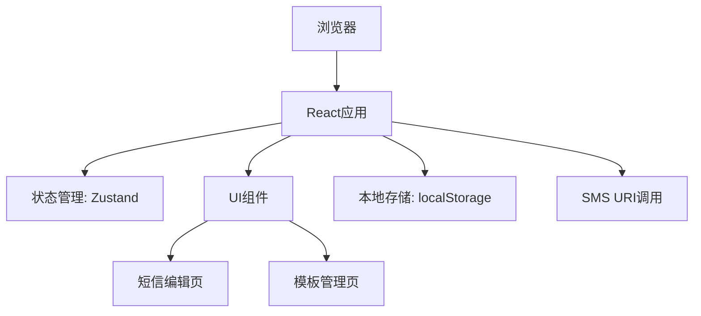

## 1. Architecture Design
这是一个纯前端应用，使用 React + Vite + TailwindCSS 技术栈，通过浏览器的 SMS URI scheme 调用手机短信应用。



## 2. Technology Description
- Frontend: React@18 + TypeScript + tailwindcss@3 + vite
- Initialization Tool: vite-init
- Backend: None (纯前端应用)
- 数据存储: 浏览器 localStorage

## 3. Route Definitions
| Route | Purpose |
|-------|---------|
| / | 短信编辑主页 |
| /templates | 短信模板页面 |

## 4. Data Model

### 4.1 数据类型定义
```typescript
interface SMSTemplate {
  id: string;
  name: string;
  content: string;
  createdAt: number;
}

interface Draft {
  phone: string;
  content: string;
  updatedAt: number;
}
```

### 4.2 本地存储结构
- `sms-templates`: 存储自定义短信模板
- `sms-draft`: 存储当前编辑的草稿
