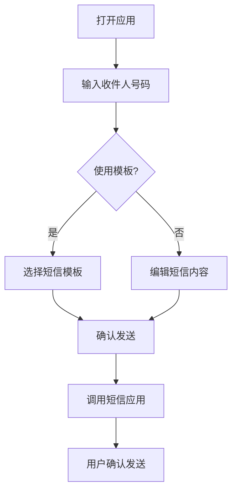

## 1. Product Overview
这是一个简洁高效的短信编辑和发送工具，允许用户快速编辑短信内容并一键打开手机原生短信应用进行发送。
- 主要解决手机上编辑长短信不方便的问题，适合需要发送格式化短信或复制粘贴内容的场景
- 目标用户是需要快速发送短信的移动设备用户

## 2. Core Features

### 2.1 Feature Module
1. **短信编辑页面**: 短信内容编辑、联系电话输入、历史记录保存
2. **短信模板页面**: 常用短信模板管理、一键填充功能

### 2.3 Page Details
| Page Name | Module Name | Feature description |
|-----------|-------------|---------------------|
| 短信编辑页面 | 内容编辑 | 支持多行文本输入、自动保存草稿、字数统计 |
| 短信编辑页面 | 发送功能 | 一键调用手机短信应用，自动填充收件人和内容 |
| 短信模板页面 | 模板管理 | 预设常用短信模板，支持自定义添加 |

## 3. Core Process
用户打开应用 → 输入收件人号码 → 编辑短信内容（或选择模板）→ 点击发送按钮 → 系统自动打开手机短信应用并填入内容 → 用户确认发送

## 4. User Interface Design
### 4.1 Design Style
- 主色调：蓝色系 (#3b82f6)，辅助色：浅灰 (#f3f4f6)
- 按钮风格：圆角矩形，带轻微阴影
- 字体：使用系统默认字体，标题较大，内容清晰易读
- 布局风格：卡片式布局，简洁直观
- 图标风格：线性简洁图标

### 4.2 Page Design Overview
| Page Name | Module Name | UI Elements |
|-----------|-------------|-------------|
| 短信编辑页面 | 编辑区域 | 卡片式容器，包含电话输入框、短信编辑框、字数统计 |
| 短信编辑页面 | 操作按钮 | 发送按钮、保存模板按钮、清空按钮 |
| 短信模板页面 | 模板列表 | 网格布局，展示模板卡片，支持点击填充 |

### 4.3 Responsiveness
- 移动优先设计，适配手机和平板设备
- 触摸优化，按钮和输入框尺寸适合手指点击

### 4.4 交互设计
- 页面切换动画
- 按钮点击反馈
- 模板选择动画
